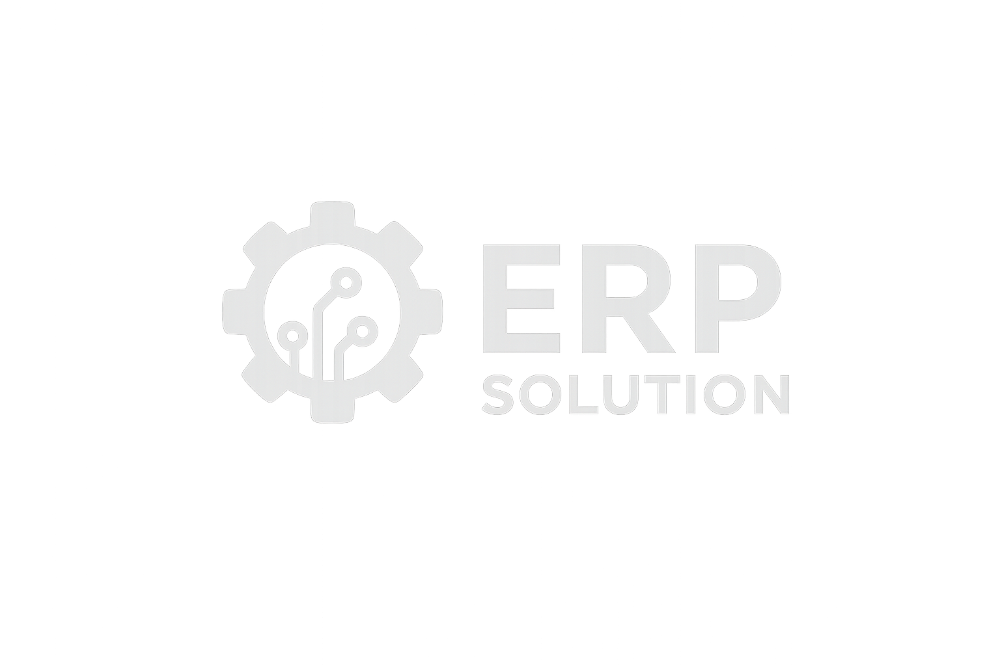

<div align="center">
  
  <h1>ERP Solution</h1>
  <p>
    A modern <b>Flutter-based ERP application</b> built to streamline internal business operations — including 
    <b>Dashboard</b>, <b>Notifications</b>, <b>Attendance</b>, and <b>HR Management</b>.
  </p>
  <p>
    
    
    
    
    
  </p>
  <p><i>Secure • Scalable • Smart • Modern</i></p>
</div>

---

## 🧾 Description

**ERP Solution** is a Flutter-based internal business application developed to centralize and streamline day-to-day company operations.  
It provides employees and administrators with a single, efficient platform to manage **attendance**, monitor **HR activities**, receive **real-time notifications**, and view **key business insights** through an interactive **dashboard**.  

The app ensures **secure API communication**, a **modular MVVM architecture**, and smooth **state management** using **Provider** — making it scalable, maintainable, and optimized for enterprise environments.  
Its goal is to **improve organizational transparency**, **minimize manual processes**, and **create a connected digital workspace** for all internal departments.

---

## 🧩 Features

✅ **Dashboard** – Quick overview of employee activities, KPIs, and performance stats.  
🔔 **Notifications** – Real-time push and in-app updates via REST API integration.  
🕒 **Attendance** – Daily tracking, history view, and status summary.  
👥 **HR Module** – Employee profiles, leave requests, and performance management.  

---

## ⚙️ Tech Stack

| Layer | Technology |
|-------|-------------|
| Frontend | Flutter (Dart) |
| State Management | Provider |
| Networking | Dio (REST API) |
| Architecture | MVVM Pattern |
| Backend | Private REST API (secured endpoints) |

---

## 🏗️ Project Structure

```plaintext
lib/
├── core/
│   ├── constants/          # App-wide constants and configuration
│   ├── utils/              # Common helpers and extensions
│   └── services/           # Networking, API clients, and shared logic
│       └── http_helper.dart
├── models/                 # Data models and response structures
├── providers/              # State management using Provider
├── screens/
│   ├── dashboard/          # Dashboard UI and logic
│   ├── notifications/      # Notification list and detail views
│   ├── attendance/         # Attendance tracking and summary
│   └── hr/                 # HR module (employee profiles, leave, etc.)
├── widgets/                # Shared UI components
└── main.dart               # App entry point
```
🧠 The structure follows a modular and scalable MVVM pattern, ensuring clean separation between logic and presentation.

---


## 🔌 API Configuration

All API requests are handled via **Dio**, with centralized configuration and secure token handling:

> Modular and maintainable structure designed for enterprise-scale projects.

```dart
final response = await dio.get(
  'https://your-company-api.com/api/endpoint',
  options: Options(headers: {'Authorization': 'Bearer $token'}),
);
```
🔒 Environment variables and credentials are securely managed within configuration constants.

---

## 🚀 Getting Started

 - Prerequisites
     - Flutter SDK 3.0+
     - Android Studio / VS Code
     - Company API access (authentication token required)
 
 - Installation
```
git clone https://github.com/TahasinHafizAveins/ERP_solution_Flutter_app.git
cd erp_solution
flutter pub get
flutter run
```

---

## 🧠 Development Guidelines
Follow MVVM architecture for clean and scalable code.
Use Provider for dependency injection and reactive UI.
Centralize all network calls for consistent API handling.
Maintain a unified ThemeData for brand consistency.
Keep feature modules independent and reusable.


---

## 📄 License
This project is proprietary and intended for internal company use only.
Unauthorized distribution, copying, or deployment outside the organization is strictly prohibited.

